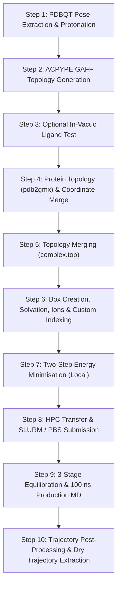

# `gmx_protlig` — Modular GROMACS Protein-Ligand MD Pipeline

A modular, robust, Pythonic pipeline and CLI suite for automated preparation, simulation, checkpointing, and trajectory post-processing of Protein-Ligand Molecular Dynamics simulations in GROMACS.

---

## Highlights & Key Features

- **End-to-End Automated MD Protocol**: Seamlessly bridges docked `PDBQT` and protein `PDB` files to 100 ns production MD and dry trajectory extraction.
- **Full Checkpointing & Safe Resume**: Native serialization of system state at every stage (`prepare_protein`, `merge_topologies`, `solvate`, `em`, `equi`, `prod`).
- **Path Relocation**: Automatic relocation and re-anchoring of checkpoint paths when moving directories across HPC nodes, workstations, or Singularity containers.
- **Batch Processing**: High-throughput batch execution using CSV or JSON manifests with automatic error handling and progress reporting (`batch_summary.json` and `batch_summary.csv`).
- **Dual Python & CLI Interfaces**: Call pythonically from scripts/notebooks or invoke via unified CLI commands (`gmx-protlig`) and standalone script wrappers.
- **Standard Pip Package**: Installable via `pip install .` or `pip install -e .` with zero lock-in.

---

## Default Simulation Protocol

| Parameter | Specification | Notes |
| :--- | :--- | :--- |
| **Target Protein** | Standard Protein Structure (`protein.pdb`) | Compatible with PDBFixer / AlphaFold / experimental PDBs |
| **Ligand** | Default Unknown Ligand (resname `UNL`) | Supports any small molecule via PDBQT / ACPYPE |
| **Protein Force Field** | AMBER99SB-ILDN | Standard charged termini (`NH₃⁺` / `COO⁻`) |
| **Ligand Parameters** | GAFF / GAFF2 + AM1-BCC charges | Generated automatically via `acpype` |
| **Water Model** | TIP3P | Rhombic dodecahedron box (1.5 nm minimum buffer) |
| **Neutralisation / Ionic** | Na⁺ / Cl⁻ at 0.15 mol/L | Auto-calculated from system charge and water count |
| **Equilibration** | 3-stage restrained NPT (~5.5 ns total) | Heavy-atom (0.5 ns) → Cα (1.0 ns) → weak Cα (4.0 ns) |
| **Production MD** | 100 ns at 310 K, 1 bar (NPT, v-rescale + Parrinello-Rahman) | 2 fs timestep with LINCS / constraints |
| **Singularity Image (Local)** | `$HOME/images/gromacs_2024.5.1-GPU_20260718.sif` | GPU-accelerated container |
| **Singularity Image (HPC)** | `$HOME/SIFDIR/gromacs/gromacs_2024.5.1-GPU_20260718.sif` | Cluster container |

---

## Installation

Inside your Singularity container or local Python environment:

```bash
# In editable development mode:
pip install -e scripts/gmx_protlig

# Or standard installation:
pip install scripts/gmx_protlig
```

### Dependencies
- Python >= 3.8
- `numpy`, `pandas`, `matplotlib`
- `gromacs_py` (pre-installed inside Singularity container)
- GROMACS >= 2024, OpenBabel (`obabel`), ACPYPE (`acpype`)

---

## Quick Start

### 1. Unified Command Line

```bash
# Display help and available subcommands
gmx-protlig --help

# Run single complex preparation (Steps 1 to 7)
gmx-protlig run \
    --protein-pdb protein.pdb \
    --ligand-pdbqt ligand.pdbqt \
    --ligand-name UnknownLigand \
    --residue-name UNL \
    --work-dir simulations/complex_unl \
    --nt-em 4

# Run batch processing across multiple complexes
gmx-protlig batch -m manifest_example.csv --up-to-step 7
```

### 2. Python API

```python
from gmx_protlig import ProteinLigandPipeline, BatchPipelineRunner

# Single complex execution
pipeline = ProteinLigandPipeline(
    protein_pdb="protein.pdb",
    ligand_pdbqt="ligand.pdbqt",
    ligand_name="UnknownLigand",
    residue_name="UNL",
    work_dir="simulations/complex_unl",
    ph=7.4,
)

# Run local prep (Steps 1 through 7)
results = pipeline.run_all_local_prep(nt_em=4)
print("Preparation complete! Checkpoint:", results["step7"]["checkpoint_path"])

# Run batch from manifest
runner = BatchPipelineRunner(manifest="manifest_example.csv")
summary = runner.run_batch(up_to_step=7, continue_on_error=True)
```

---

## Detailed Step-by-Step Guide



---

### Step 1: Extract & Protonate Ligand

Extracts the top-ranked pose (most negative Vina score) from docked `PDBQT`, converts to standard PDB format with OpenBabel, and applies protonation at target pH.

```bash
# Via CLI
gmx-protlig step1 \
    --input-pdbqt ligand.pdbqt \
    --ligand-name UnknownLigand \
    --residue-name UNL \
    --ph 7.4

# Or via script wrapper
bash run_local.sh 01_extract_and_prepare_ligand.py \
    --input-pdbqt ligand.pdbqt \
    --ligand-name UnknownLigand \
    --residue-name UNL \
    --ph 7.4
```

**Key Outputs (`ligand/`):**
- `<ligand_name>_pose1.pdbqt` — Extracted best docking pose
- `<ligand_name>_raw.pdb` — Unprotonated intermediate PDB
- `<RESIDUE_NAME>.pdb` — Fully protonated ligand with standardized 3-letter residue name (e.g. `UNL.pdb`)

---

### Step 2: AMBER Topology Generation (`acpype`)

Runs ACPYPE with AM1-BCC charge calculation and GAFF/GAFF2 parameter assignment.

```bash
# Via CLI
gmx-protlig step2 --residue-name UNL --net-charge 0 --charge-method bcc

# Or via script wrapper
bash run_local.sh 02_run_acpype.sh --residue-name UNL
```

**Key Outputs (`ligand/<RESIDUE_NAME>.acpype/`):**
- `<RES>_GMX.gro` — GROMACS coordinate file
- `<RES>_GMX.top` — Complete standalone AMBER topology (containing `[ atomtypes ]`)
- `<RES>_GMX.itp` — Modular molecule-level topology
- `posre_<RES>.itp` — Ligand position restraints

---

### Step 3: In-Vacuo Ligand Simulation Test (Recommended)

Validates topology stability by running a short energy minimisation followed by 100 ps of in-vacuo MD.

```bash
# Via CLI
gmx-protlig step3 --residue-name UNL --ntomp 4

# Or via script wrapper
bash run_local.sh 03_ligand_invacuo.sh --residue-name UNL
```

**Key Outputs (`invacuo/`):**
- `em_vac.gro`, `em_vac.log` — Minimised vacuum structure
- `md_vac.trr`, `md_vac.log` — 100 ps test trajectory (verify stability in VMD)

---

### Step 4: Prepare Protein Topology & Combine Coordinates

Executes `pdb2gmx` with AMBER99SB-ILDN force field, standard termini (`NH₃⁺` / `COO⁻`), and renumbered coordinates combined with ligand coordinates.

```bash
# Via CLI
gmx-protlig step4 --protein-pdb protein.pdb --residue-name UNL

# Or via script wrapper
bash run_local.sh 04_prepare_protein.py --protein-pdb protein.pdb --residue-name UNL
```

**Key Outputs:**
- `protein/` — `pdb2gmx` topology, coordinate, and restraint files
- `complex_raw/complex_raw.gro` — Combined protein + ligand coordinate file
- `checkpoint.prepare_protein_YYYYMMDD_HHMMSS.pycpt` — Checkpoint file

---

### Step 5: Merge Topologies

Merges protein and ligand topologies into a unified `complex/complex.top` file:
1. Strips global directives from ligand ITP.
2. Injects ligand `[ atomtypes ]` and `[ nonbond_params ]` directly below `forcefield.itp`.
3. Injects `#include "<RES>_GMX.itp"` before water includes.
4. Appends `<RES> 1` under `[ molecules ]`.
5. Rewrites all relative `#include` paths.

```bash
# Via CLI
gmx-protlig step5 --residue-name UNL --protein-pdb protein.pdb

# Or via script wrapper
bash run_local.sh 05_merge_topologies.py --residue-name UNL
```

**Topology Verification Checklist (`complex/complex.top`):**
- [ ] Near the top, after `#include "...forcefield.itp"`, verify the `[ atomtypes ]` block exists for ligand atom types.
- [ ] Before the water `#include`, verify `#include "<RES>_GMX.itp"` (e.g. `UNL_GMX.itp`) is present.
- [ ] In the `[ molecules ]` section at the end, verify both protein and ligand entries are listed:
  ```text
  [ molecules ]
  ; Compound        #mols
  Protein_chain_A     1
  UNL                 1
  ```

---

### Step 6: Box Creation, Solvation, Ions & Custom Indexing

Creates a rhombic dodecahedron box (1.5 nm minimum clearance), solvates with TIP3P water, neutralises at 0.15 mol/L NaCl, and generates custom index groups.

```bash
# Via CLI
gmx-protlig step6 --residue-name UNL --ion-conc 0.15 --box-dist 1.5 --box-type dodecahedron

# Or via script wrapper
bash run_local.sh 06_solvate_ions_index.py --residue-name UNL --ion-conc 0.15 --box-dist 1.5
```

**Generated Custom Index Groups in `complex_solv/index.ndx`:**
- `[ Protein_<RESNAME> ]` (e.g. `Protein_UNL`) — Solute group (protein + ligand) for temperature coupling
- `[ Dry ]` — Water- and ion-free group for trajectory extraction
- `[ Water_and_ions ]` — Solvent + electrolyte bath group for temperature coupling

---

### Step 7: Energy Minimisation (Local)

Performs two-step steepest descent energy minimisation:
1. **Unconstrained Minimisation**: Eliminates steric clashes and initial strains.
2. **Bond-Constrained Minimisation**: Relaxes bond geometries (criterion: $F_{\text{max}} < 10\text{ kJ mol}^{-1}\text{ nm}^{-1}$).
3. Automatically generates potential energy profile plot: `em/em_energy.png`.

```bash
# Via CLI
gmx-protlig step7 --nt 4

# Or via script wrapper
bash run_local.sh 07_energy_minimization.py --nt 4
```

**Key Outputs (`em/`):**
- `em_energy.png` — Convergence energy plot
- `checkpoint.em_YYYYMMDD_HHMMSS.pycpt` — **Transfer this checkpoint to HPC for production MD**

---

### Step 8: Transfer to HPC & Batch Job Submission

#### 1. Transfer Simulation Folder to HPC
```bash
rsync -avz --progress simulations/ <user>@<hpc_host>:/path/to/simulations/
```

#### 2. Submit SLURM or PBS Job

**For SLURM clusters (`09_hpc_submit.sbatch`):**
```bash
cd /path/to/simulations
sbatch 09_hpc_submit.sbatch
```

**For PBS/Torque clusters (`09_hpc_submit.pbs`):**
```bash
cd /path/to/simulations
qsub 09_hpc_submit.pbs
```

**Interactive Singularity Session (Debugging / Manual Runs):**
```bash
srun --partition=GPU --gres=mps:50 --ntasks=1 --cpus-per-task=16 --pty \
    singularity shell --nv \
    -B "${PWD}:/host_pwd" \
    --pwd /host_pwd \
    /path/to/singularity/gromacs_2024.5.1-GPU_20260718.sif
```

---

### Step 9: Equilibration, Production & Automated Post-Processing

When executed on the HPC (or locally via Step 8), the following stages run automatically:

1. **Equilibration (~5.5 ns total)**:
   - **Stage 1 (0.5 ns, $\Delta t = 1\text{ fs}$)**: Heavy-atom position restraints ($k = 1000\text{ kJ mol}^{-1}\text{ nm}^{-2}$)
   - **Stage 2 (1.0 ns, $\Delta t = 2\text{ fs}$)**: C$\alpha$ position restraints ($k = 1000\text{ kJ mol}^{-1}\text{ nm}^{-2}$)
   - **Stage 3 (4.0 ns, $\Delta t = 2\text{ fs}$)**: Weak C$\alpha$ position restraints ($k = 100\text{ kJ mol}^{-1}\text{ nm}^{-2}$)
2. **Production MD (100 ns)**:
   - $NPT$ ensemble, $T = 310\text{ K}$, $P = 1.0\text{ bar}$, LINCS constraints on all bonds.
3. **Trajectory Post-Processing**:
   - Trajectory whole repair (`pbc = mol`)
   - Rotational and translational complex alignment (`fit = rot+trans`)
   - Centering solute inside the box
   - Automatic dry trajectory extraction (`prod/traj_dry.xtc`) and dry topology (`prod/traj_dry.tpr`)

---

### Step 10: Trajectory Inspection, VMD & RMSD Analysis

#### 1. Download Dry Trajectory from HPC
```bash
scp <user>@<hpc_host>:/path/to/simulations/prod/traj_dry.* .
```

#### 2. Visualise in VMD
1. Launch VMD: `vmd`
2. **File → New Molecule** → Load `traj_dry.tpr` (determines atom types and bonds)
3. **File → Load Data Into Molecule** → Load `traj_dry.xtc` (trajectory coordinates)
4. Set representation: Protein as `NewCartoon`, Ligand as `Licorice`.

#### 3. Compute Backbone RMSD
```bash
singularity exec -B "${PWD}:/host_pwd" --pwd /host_pwd \
    $HOME/images/gromacs_2024.5.1-GPU_20260718.sif \
    gmx rms \
        -s prod/traj_dry.tpr \
        -f prod/traj_dry.xtc \
        -o prod/rmsd_backbone.xvg \
        -n complex_solv/index.ndx
```
*(Select `Backbone` for least-squares fit and `Backbone` for RMSD calculation).*

---

## Batch Processing from Manifests

Run multiple complexes iteratively with automatic error isolation and summary report generation:

### Manifest Format (`manifest_example.csv`):
```csv
protein_pdb,ligand_pdbqt,ligand_name,residue_name,work_dir,ph,prepare_top,ion_conc,box_dist,nt_em
protein.pdb,ligand_1.pdbqt,Ligand1,UNL,simulations/complex_1,7.4,False,0.15,1.5,4
protein.pdb,ligand_2.pdbqt,Ligand2,UNL,simulations/complex_2,7.4,False,0.15,1.5,4
```

### Manifest Format (`manifest_example.json`):
```json
{
  "complexes": [
    {
      "protein_pdb": "protein.pdb",
      "ligand_pdbqt": "ligand_1.pdbqt",
      "ligand_name": "Ligand1",
      "residue_name": "UNL",
      "work_dir": "simulations/complex_1",
      "ph": 7.4,
      "prepare_top": false,
      "ion_conc": 0.15,
      "box_dist": 1.5,
      "nt_em": 4
    }
  ]
}
```

### Running Batch Mode:
```bash
# Via CLI:
gmx-protlig-batch -m manifest_example.csv --up-to-step 7

# Via Python:
from gmx_protlig import BatchPipelineRunner

runner = BatchPipelineRunner(manifest="manifest_example.csv")
results = runner.run_batch(up_to_step=7, continue_on_error=True)
```

Outputs `batch_summary.json` and `batch_summary.csv` summarizing status, step reached, execution time, and any error traces.

---

## Checkpointing & Relocation Utilities

`gmx_protlig` automatically serializes checkpoint states after every major milestone.

```python
from gmx_protlig import save_checkpoint, load_latest_checkpoint, relocate_checkpoint_paths

# 1. Save checkpoint
chkpt_path = save_checkpoint(complex_sys, "em", search_dir="simulations/complex_1")

# 2. Load latest checkpoint
complex_sys, file_path = load_latest_checkpoint("em", search_dir="simulations/complex_1")

# 3. Relocate paths if folder was moved from cluster to workstation
complex_sys = relocate_checkpoint_paths(complex_sys, new_base_dir="simulations/complex_1")
```

---

## Customising Ligand Residue Names (3-Letter Code)

GROMACS requires a **unique 3-letter alphanumeric code** for each ligand. By default, `gmx_protlig` uses `UNL` (Unknown Ligand).

| Example Ligand | Residue Code | Command Option | Notes |
| :--- | :--- | :--- | :--- |
| **Default Unknown Ligand** | `UNL` | `--residue-name UNL` | Default identifier across the pipeline |
| **Custom Ligand Pose 1** | `L01` | `--residue-name L01` | Example 3-letter identifier |
| **Custom Molecule** | `MOL` | `--residue-name MOL` | Example 3-letter identifier |
| **Custom Drug Compound** | `DRG` | `--residue-name DRG` | Example 3-letter identifier |

---

## CLI & Script Reference

| CLI Command | Standalone Script | Description |
| :--- | :--- | :--- |
| `gmx-protlig step1` | `01_extract_and_prepare_ligand.py` | Extract best docked pose and protonate |
| `gmx-protlig step2` | `02_run_acpype.py` (`02_run_acpype.sh`) | ACPYPE topology generation |
| `gmx-protlig step3` | `03_ligand_invacuo.py` (`03_ligand_invacuo.sh`) | In-vacuo ligand MD test |
| `gmx-protlig step4` | `04_prepare_protein.py` | `pdb2gmx` protein topology & coordinate merge |
| `gmx-protlig step5` | `05_merge_topologies.py` | Topology merging & include rewriting |
| `gmx-protlig step6` | `06_solvate_ions_index.py` | Dodecahedron box, solvation, ions & indexing |
| `gmx-protlig step7` | `07_energy_minimization.py` | Two-stage local energy minimisation |
| `gmx-protlig step8` | `08_hpc_equi_prod.py` | HPC equilibration & 100 ns production MD |
| `gmx-protlig run` | `example_batch_run.py` | End-to-end pipeline for a single complex |
| `gmx-protlig batch` | `example_batch_run.py` | High-throughput batch execution from manifest |
| — | `09_hpc_submit.sbatch` | SLURM batch job submission script |
| — | `09_hpc_submit.pbs` | OpenPBS / Torque batch job submission script |
| — | `run_local.sh` | Local Singularity wrapper |

---

## Troubleshooting Guide

| Issue | Likely Cause | Solution |
| :--- | :--- | :--- |
| `acpype` fails with charge error | Incorrect formal charge or missing H | Verify net charge with `--net-charge <N>` or adjust protonation pH in Step 1. |
| `pdb2gmx` fails with missing atoms | Non-standard residues or missing atoms in PDB | Run PDBFixer beforehand; pass `--prepare-top` to rebuild hydrogens. |
| `Invalid order for directive atomtypes` | `[ atomtypes ]` placed after `[ moleculetype ]` | Merged topology issue; Step 5 handles this automatically. Verify `complex/complex.top`. |
| Energy minimisation does not converge | Severe steric clashes or overlapping coordinates | Increase `--nt` or check starting PDBQT pose. Ensure in-vacuo ligand test (Step 3) passed. |
| `Production MD` crashes on Step 8 | Temperature coupling group mismatch | Verify `[ Protein_<RESNAME> ]` and `[ Water_and_ions ]` exist in `complex_solv/index.ndx`. |
| `traj_dry.xtc` is empty or missing | Missing `Dry` group in index file | Run `gmx-protlig step6` to regenerate custom index groups. |
| Checkpoint loading fails across nodes | Hardcoded paths from previous workstation/cluster | Use `relocate_checkpoint_paths(complex_sys, new_dir)` to auto-rebind paths. |

---

## Complete Simulation Directory Structure

```text
simulations/complex_unl/
├── ligand/
│   ├── ligand_pose1.pdbqt
│   ├── ligand_raw.pdb
│   ├── UNL.pdb
│   └── UNL.acpype/
│       ├── UNL_GMX.gro
│       ├── UNL_GMX.top
│       ├── UNL_GMX.itp
│       └── posre_UNL.itp
├── invacuo/                    # (Optional) in-vacuo test results
│   ├── em_vac.gro
│   └── md_vac.trr
├── protein/                    # Protein topology from pdb2gmx
│   ├── topol.top
│   └── protein_pdb2gmx.gro
├── complex_raw/
│   └── complex_raw.gro         # Combined coordinates before topology merge
├── complex/
│   ├── complex.top             # Merged master topology
│   ├── complex.gro
│   ├── UNL_GMX.itp
│   └── posre_UNL.itp
├── complex_solv/
│   ├── complex_unl_water_ion.gro
│   ├── complex_unl_water_ion.top
│   └── index.ndx               # Custom index with Protein_UNL, Dry, Water_and_ions
├── em/
│   ├── em_energy.png           # Potential energy convergence plot
│   └── complex_unl_water_ion.gro
├── checkpoint.em_YYYYMMDD_HHMMSS.pycpt   # Transfer to HPC
├── equi/                       # Equilibration output (on HPC)
│   ├── sys_em/
│   └── sys_equi/
├── prod/                       # Production output (on HPC)
│   ├── prod_complex_unl.gro
│   ├── prod_complex_unl.xtc
│   ├── prod_complex_unl.edr
│   ├── traj_dry.xtc            # Extracted solute trajectory (for VMD)
│   └── traj_dry.tpr            # Extracted solute topology (for VMD)
├── checkpoint.equi_YYYYMMDD_HHMMSS.pycpt
└── checkpoint.prod_YYYYMMDD_HHMMSS.pycpt
```
